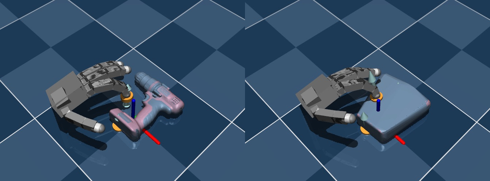
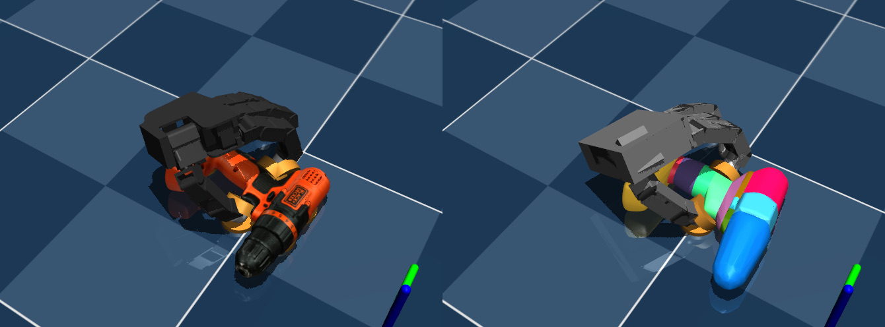

# MuJoCo-Asset-Pipeline

- Download the YCB dataset from the website
- Use `obj2mjcf` for convex decomposition (MuJoCo only supports convex meshes for collision detection), and generate the XML files for each object
- Use `dm_control` to merge the objects with a scene template

- Before decomposition:

- After decomposition:

## ycb_downloader.py

- **`-o`, `--output`** — Output directory (default: `asset/ycb`).
- **`--no-extract`** — Do not extract `.tgz` after download.
- **`--no-skip-mujoco`** — Download all objects; by default only objects with MuJoCo-compatible meshes (google_16k / tsdf / berkeley_processed) are downloaded.
- **`--no-skip-existing`** — Re-download even if the `.tgz` or extracted folder already exists.

Configure in script: `objects_to_download` (e.g. `"all"` or a list), `files_to_download` (e.g. `["berkeley_processed", "google_16k"]`).

## obj2xml_ycb.py

- **`-y`, `--ycb-root`** — YCB asset root (default: `asset/ycb`).
- **`-o`, `--output`** — XML output root (default: `asset/ycb_xml`).
- **`--no-decompose`** — Disable convex decomposition when calling obj2mjcf.
- **`-n`, `--dry-run`** — List objects that would be processed, no conversion.
- **`--limit N`** — Process only the first N objects.
- **`--debug`** — Same as `--limit 5` for quick testing.

Requires `obj2mjcf` (e.g. `pip install obj2mjcf`). Only objects with `google_16k/textured.obj` are converted.

## combine_scene.py

- **`-o`, `--object`** — Path to the object MuJoCo XML (required).
- **`-s`, `--scene-template`** — Path to the scene template XML (e.g. `asset/scene_template/ground.xml`, `asset/scene_template/table.xml`).
- **`--out-dir`** — Output root directory (default `asset/scene`). Combined model is written to a subfolder `<template>_<object>/` with a **self-contained** XML and assets (meshes, textures).
- **`--no-freejoint`** — Do not add a freejoint to the object’s root body (by default a freejoint is added for unconstrained motion).
- **`--spawn-pos`** — Spawn position `x y z` (default `0 0 0.45`).
- **`--spawn-euler`** — Spawn orientation in Euler angles (radians) `rx ry rz` (default `0 0 0`).

Requires `dm_control` (e.g. `pip install dm_control`). Example: `python combine_scene.py -o path/to/object.xml -s asset/scene_template/table.xml`.
